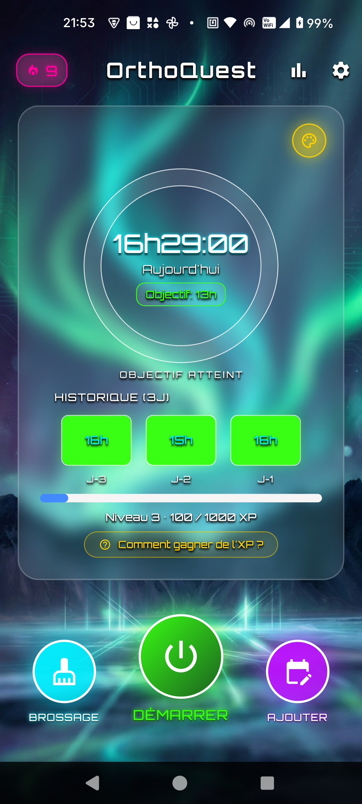
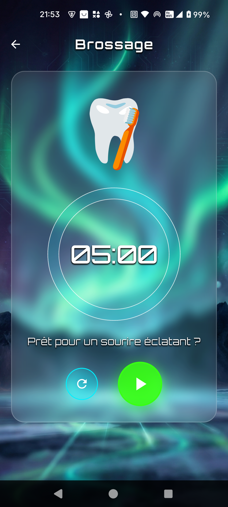
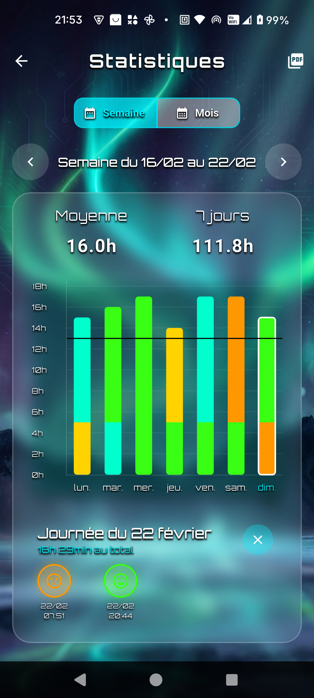
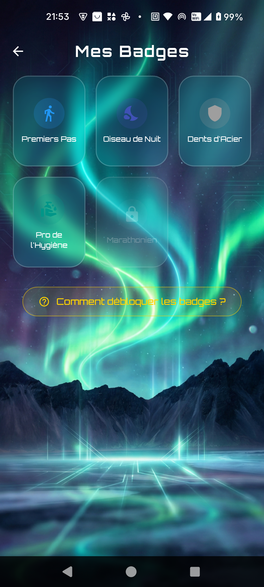
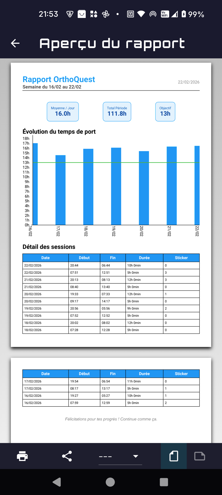
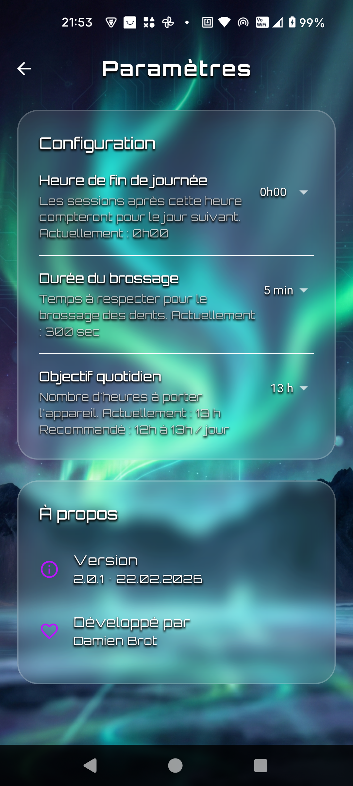

# OrthoQuest


**OrthoQuest** est une application mobile gamifiée qui aide les enfants et adolescents à suivre le temps de port de leur appareil dentaire. Avec un objectif quotidien configurable (par défaut 13h), l'app transforme une routine contraignante en aventure motivante grâce à un système de niveaux, badges, séries et thèmes visuels à débloquer.

Développée en Suisse par Damien Brot.

---

## Captures d'écran

<p align="center">
  
  
  
  
</p>
<p align="center">
  
  
</p>

---

## Fonctionnalités

### Suivi du temps de port
- Timer Start/Stop avec sauvegarde automatique toutes les 30 secondes
- Jauge circulaire de progression quotidienne avec couleur dynamique
- Restauration automatique de la session en cours après fermeture de l'app
- Ajout, modification et suppression de sessions (avec recalcul automatique de l'XP)
- Heure de fin de journée configurable (découpage automatique des sessions cross-day)

### Timer de brossage
- Minuteur configurable de 1 à 5 minutes avec animation et retour sonore
- Confettis de célébration à la fin du brossage
- Récompense de 50 XP par brossage

### Système de progression
- **XP et niveaux** : 10 XP par heure de port + 50 XP par brossage, 1000 XP par niveau
- **Série quotidienne** : flamme colorée selon la longueur de la série
- **5 badges** à débloquer : Premiers Pas, Oiseau de Nuit, Dents d'Acier, Pro de l'Hygiène, Marathonien
- **Célébration de montée de niveau** avec animation Lottie et confettis

### Stickers d'humeur
- 5 stickers associés aux sessions (Super, Bien, Moyen, Douleur, Difficile)
- Timeline des stickers dans les statistiques

### Statistiques et rapports
- Vue hebdomadaire et mensuelle avec graphique à barres interactif
- Barres empilées colorées par sticker, ligne d'objectif, zoom et navigation
- Export PDF des rapports (format A4, avec graphique et tableau détaillé)

### Personnalisation
- **10 thèmes visuels** à débloquer par niveau (Néon, Espace, Aurore Boréale, Émeraude...)
- Réglage de la transparence et du flou des cartes (glassmorphism)
- Définition d'un thème comme fond d'écran du téléphone (Android uniquement)

### Sauvegarde et restauration
- Export de la base de données (partage du fichier .db)
- Import d'une sauvegarde avec backup de sécurité automatique

### Onboarding
- 6 pages de bienvenue animées présentant les fonctionnalités
- Rejouable depuis les paramètres avancés

### Interface responsive
- Adaptation automatique à toutes les résolutions d'écran
- Optimisation des images de fond (décodage à la taille d'affichage)
- Mode plein écran edge-to-edge

---

## Stack technique

| Composant | Technologie |
|-----------|-------------|
| Framework | [Flutter](https://flutter.dev/) |
| Langage | Dart (SDK ^3.10.8) |
| Gestion d'état | [Riverpod](https://riverpod.dev/) 3.x (architecture `NotifierProvider`) |
| Base de données | SQLite via `sqflite` (v5 avec migrations) |
| Graphiques | `fl_chart` |
| PDF | `pdf` + `printing` |
| Animations | `lottie`, `confetti`, `avatar_glow` |
| Audio | `audioplayers` |
| Polices | Google Fonts (Orbitron, Roboto) |
| Fond d'écran | `wallpaper_handler` (Android natif, export conditionnel cross-platform) |
| Partage / Import | `share_plus`, `file_picker` |

---

## Structure du projet

```
lib/
├── main.dart               # Point d'entrée, splash screen
├── models/                 # Modèles de données (Session, Badge, Setting)
├── providers/              # Gestion d'état Riverpod (Timer, User, Brushing)
├── services/               # Services (Database, PDF, Notification, Wallpaper)
├── ui/
│   ├── screens/            # 8 écrans (Home, Brushing, Reports, Badges, Rewards,
│   │                       #   Settings, Onboarding, PdfPreview)
│   └── widgets/            # Widgets réutilisables (DailyProgressCard, ActionButtons,
│                           #   HistoryCard, LevelBar, VibrantCard, LevelUpDialog, etc.)
└── utils/                  # Utilitaires (AppTheme, BuildInfo, formatage)

scripts/
└── optimize_themes.py      # Optimisation des images de thèmes (Pillow)
```

---

## Installation et lancement

### Prérequis

- [Flutter SDK](https://docs.flutter.dev/get-started/install) installé et configuré
- Android SDK (pour le build Android)
- Un émulateur Android ou un appareil physique connecté

### Lancement

```bash
flutter pub get
flutter run
```

### Optimisation des images de thèmes

```bash
pip install Pillow
python scripts/optimize_themes.py
```

Le script redimensionne les images à 1080px de largeur (format mobile) et compresse les PNG.

---

## Build release

Le script `build_release.ps1` génère automatiquement le fichier `lib/utils/build_info.dart` (version + date de build), puis propose un menu interactif :

```powershell
.\build_release.ps1
```

Options disponibles :
1. APK standard
2. APK split par architecture
3. App Bundle (Google Play Store)
4. Windows Desktop
5. Nettoyage seul

La version et la date de build sont affichées dans la page des paramètres de l'app.

---

## Publication Google Play Store

L'application est configurée pour la publication sur le Google Play Store.

### Fichiers de configuration

| Fichier | Description | Versionné |
|---------|-------------|-----------|
| `android/app/build.gradle.kts` | Configuration Gradle avec signature release et ProGuard | Oui |
| `android/app/proguard-rules.pro` | Règles ProGuard pour l'optimisation | Oui |
| `android/key.properties` | Références au keystore | **Non** |
| `android/app/upload-keystore.jks` | Clé de signature upload | **Non** |
| `privacy_policy.html` | Politique de confidentialité | Oui |
| `PUBLISH_GUIDE.md` | Guide complet de publication étape par étape | Oui |

### Compiler pour le Play Store

```bash
flutter build appbundle --release
```

Le fichier `.aab` signé est généré dans `build/app/outputs/bundle/release/`.

---

## Confidentialité

OrthoQuest ne collecte, ne transmet et ne partage **aucune donnée personnelle**. Toutes les données sont stockées **exclusivement sur l'appareil** de l'utilisateur (SQLite + SharedPreferences). Aucun service tiers de suivi, d'analyse ou de publicité n'est intégré. Aucun compte utilisateur n'est requis.

Conforme au RGPD (UE) et à la nLPD (Suisse).

Voir [`privacy_policy.html`](https://dabouse.github.io/OrthoQuest/privacy_policy.html) pour la politique complète.

---

## Configuration

| Paramètre | Description | Défaut |
|------------|-------------|--------|
| Heure de fin de journée | Heure à partir de laquelle une nouvelle journée commence | 0h (minuit) |
| Durée du brossage | Durée du minuteur de brossage | 5 min |
| Objectif quotidien | Nombre d'heures de port cible par jour | 13h |

### Zone avancée (cachée)

Accessible après 5 taps sur le numéro de version dans les paramètres :
- Revoir l'introduction (onboarding)
- Exporter / importer la base de données
- Générer des données de test (21 jours)
- Effacer toutes les données

---

## Auteur

Développé par **Damien Brot** en Suisse.

## Licence

Copyright (c) 2026 Damien Brot. **Tous droits réservés.**

Le code source est mis à disposition à titre de consultation uniquement.
Voir le fichier [`LICENSE`](LICENSE) pour les conditions complètes.
